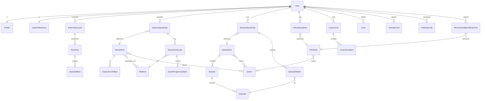

# Premier modèle de données

> Étapes 11 et 12 du cadrage — rédigé le 2026-07-17. Modèle conceptuel (pas encore le schéma SQL final). Objectif : couvrir les ~30 entités du cahier des charges, résoudre les deux points délicats (multi-possession d'un jeu, provenance des données) sans surarchitecturer.

## Décision structurante n°1 — catalogue partagé vs suivi personnel

Le cahier des charges pose la question « entité média commune / entités séparées / combinaison ». **Réponse : une combinaison, mais séparée selon un autre axe que le type de média — l'axe _catalogue_ vs _suivi_.**

- **Couche CATALOGUE** (données objectives, issues des API, **partagées entre tous les utilisateurs**, mises en cache) : un jeu, un film, une série existent **une seule fois** en base, quel que soit le nombre d'utilisateurs qui les suivent. On y stocke le snapshot fournisseur.
- **Couche SUIVI** (données personnelles : statut, note, progression, temps) : propre à chaque utilisateur, elle **référence** le catalogue.

Pourquoi ce découpage plutôt qu'une grosse table `media` polymorphe : les trois médias ont des données catalogue **très différentes** (un jeu a des plateformes et des durées de complétion, une série a saisons/épisodes, un film a une durée simple). Les forcer dans une table commune multiplierait les colonnes nulles. On garde donc **trois entités catalogue concrètes** (`GameWork`, `SeriesWork`+`Season`+`Episode`, `FilmWork`), et on unifie là où c'est utile : le **suivi**, les **listes**, l'**historique** et les **statistiques** raisonnent sur une référence média typée `(media_type, work_id)`.

## Décision structurante n°2 — multi-possession d'un jeu

Exigence explicite : le même jeu sur PlayStation **et** Steam = temps de jeu et progressions **distincts**, mais c'est **le même jeu** et **le même avis**.

→ Deux niveaux pour les jeux :

- `GameLibraryEntry` (un par utilisateur × jeu) : ce que l'utilisateur pense **du jeu** — note, avis, notes perso, favori, objectif de complétion par défaut.
- `GameOwnership` (un par **plateforme** possédée) : ce qui est **spécifique à la copie** — statut, temps joué, progression, dates (achat/début/fin/dernière session), trophées, objectif de complétion propre s'il diffère.

Ainsi « Elden Ring sur PS5 terminé à 60 h » et « Elden Ring sur PC en cours à 12 h » cohabitent, avec une seule note et un seul avis au niveau du jeu.

## Décision structurante n°3 — provenance auto / manuel / modifié

Exigence : distinguer données récupérées automatiquement, saisies manuellement, et modifiées par l'utilisateur ; **ne jamais écraser une modification manuelle** lors d'un rafraîchissement.

→ Le **catalogue** stocke la vérité fournisseur (`auto`). Les surcharges utilisateur vont dans une table dédiée `FieldOverride` (générique) :

```
FieldOverride(user_id, entity_type, entity_id, field_name, value, source, updated_at)
  source ∈ { manual, overridden }   -- manual = champ absent du fournisseur ; overridden = valeur fournisseur modifiée
```

À l'affichage, la valeur effective = override si présent, sinon snapshot catalogue. Au rafraîchissement, on ne touche qu'au catalogue → les overrides survivent par construction. La provenance d'un champ se déduit : override présent ⇒ `manual`/`overridden`, sinon ⇒ `auto`. Ce pattern générique évite de dupliquer des colonnes `x_source` partout.

## Diagramme des entités (Mermaid)



## Entités — description

### Comptes et profil

- **User** : identité, e-mail, hash mot de passe (Argon2id), état (actif, en suppression), timestamps. RGPD : suppression complète en cascade + export.
- **Profile** : pseudo, avatar, bio courte.
- **UserPreferences** : thème (clair/sombre/auto), langue, préférences de reco, unités.
- **ExternalAccount** : `provider` (steam…), identifiant externe, **jetons OAuth chiffrés**, portée, statut, expiration, `revoked_at`. Jamais de mot de passe tiers ni de token de session non officiel (cf. faisabilité).

### Catalogue (partagé, snapshot fournisseur = provenance `auto`)

- **GameWork** : réf. externe (IGDB id), titre, synopsis, jaquette, développeur/éditeur, date de sortie, `refreshed_at`.
- **GameTimeToBeat** : `main`, `main_extra`, `completionist` (secondes), `submission_count` (fiabilité) — depuis IGDB `game_time_to_beats`.
- **SeriesWork / Season / Episode** : hiérarchie ; l'épisode porte durée, numéro, **date de diffusion** (→ distinction diffusé/annoncé pour le temps restant), réf. TMDB/TVmaze.
- **FilmWork** : titre, synopsis, **durée**, date de sortie, réf. TMDB.
- **Platform** : PS5, PC/Steam, Switch… (référentiel).
- **Genre** : référentiel partagé aux 3 médias.
- **WatchProviderAvailability** (films/séries, par pays FR) : cache JustWatch via TMDB — ⚠️ attribution par fiche.

### Suivi — Jeux (2 niveaux)

- **GameLibraryEntry** (user × jeu) : note, avis, notes perso, favori, objectif de complétion par défaut.
- **GameOwnership** (× plateforme) : statut (envie/backlog/en cours/en pause/terminé/100 %/abandonné), temps joué, progression (% + mission/chapitre/zone texte, **prochain objectif**, **note de reprise**), dates (achat, début, fin, dernière session), trophées `obtenus/total`, objectif de complétion propre.
- **GameProgressUpdate** : journal daté (historique des mises à jour de progression) rattaché à une possession.

> Note « envie » : un jeu en liste d'envies n'est pas encore possédé → il peut exister une `GameLibraryEntry` avec statut `wishlist` **sans** `GameOwnership` (la possession n'existe qu'à l'achat). C'est ce qui distingue proprement **liste d'envies** (pas de possession) et **backlog** (possession, statut « pas commencé »).

### Suivi — Séries

- **SeriesLibraryEntry** : statut (à voir/en cours/en pause/terminée/abandonnée/favorite), note, avis, notes perso, date du dernier épisode vu (dérivable).
- **EpisodeWatch** : marque un épisode vu (user × episode, `watched_at`). Marquer une saison = créer les `EpisodeWatch` correspondants ; annuler = les supprimer. Progression et temps restant se **calculent** à partir de là (pas stockés en dur).

### Suivi — Films

- **FilmLibraryEntry** : statut/liste (à voir/vu/favori/pas apprécié/abandonné/proposé-refusé), note, avis, notes perso, date de visionnage, envie de revoir, « vu avec » (texte V1).

### Organisation, objectifs, activité

- **CustomList** + **CustomListItem** : listes personnalisées (V2), items polymorphes `(media_type, work_id)`.
- **Goal** : objectif perso (V2) — type, cible, période, progression.
- **ActivityEvent** : journal d'activité **écrit dès la V1** (ajout, changement de statut, progression, visionnage), la page dédiée arrivant en V2. Alimente aussi statistiques et reco.

### Recommandation (V2) et synchronisation (V3)

- **RecommendationResponse** : réponses swipe (oui/non/déjà vu) sur un `FilmWork` + contexte (envies du moment) → améliore les propositions suivantes.
- **SyncRun** : une exécution d'import/synchro d'un `ExternalAccount` (statut, erreurs, quotas).
- **ImportedItem** : élément importé + lien vers l'entité créée, pour **dédoublonnage**, **fusion** et **suppression** des données importées (exigence forte).

### Transverse

- **FieldOverride** : surcharges manuelles (voir décision n°3). S'applique aux durées de jeux, durées d'épisodes, métadonnées éditées, estimations, etc.

## Ce qui est calculé et non stocké (cohérence RT-6)

Pour éviter les incohérences, on **calcule à la demande** (module `time-budget` pur) plutôt que de stocker : progression série (% depuis `EpisodeWatch`), temps restant (par item et agrégé), durées consacrées, répartitions du tableau de bord. Mise en cache applicative si nécessaire, jamais comme source de vérité. Les seules valeurs « temps » stockées sont les **saisies** (heures jouées) et les **overrides**.

## Points ouverts pour le schéma SQL (phase D / début dev)

1. Note/avis au niveau `GameLibraryEntry` uniquement, ou aussi par possession ? → proposé : au niveau jeu (une opinion), à confirmer à l'usage.
2. Indexation : réf. externes (unicité par fournisseur), recherche locale (`pg_trgm`), `EpisodeWatch(user, episode)` unique.
3. Stratégie exacte de cache catalogue (TTL par fournisseur : TMDB 6 mois, images IGDB 30 j).
4. Chiffrement des jetons `ExternalAccount` (au niveau applicatif) — détaillé en stratégie sécurité (étape 23).
