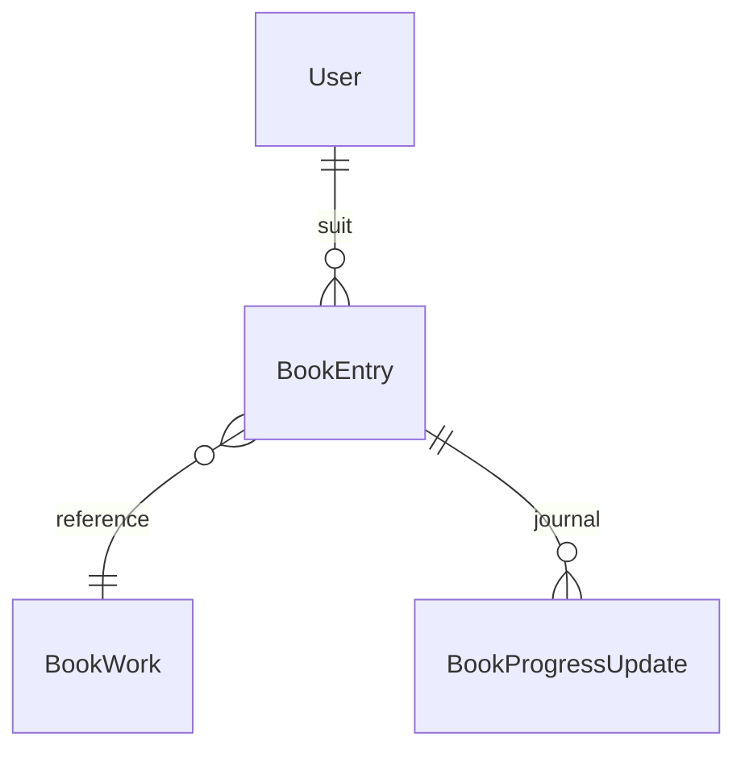

# Lot livres (V2) — cadrage

> Rédigé le 2026-07-22, hors périmètre V1 (le suivi livres est au backlog produit de `02-mvp-et-versions.md`). Objectif : ajouter la 4e verticale **livres** — bibliothèque, progression, **temps de lecture restant** — en réutilisant les motifs existants (catalogue/suivi, provenance, module `time-budget` pur). Anti-usine-à-gaz : le lot vise le volume de la verticale films (la plus simple), pas celui des jeux.

## Ce que le lot livre

- Chercher un livre, l'ajouter à sa bibliothèque (envie / à lire / en cours / terminé / abandonné).
- Saisir sa progression **en pages** ; voir le **temps de lecture restant estimé**, personnalisé par la vitesse de lecture de l'utilisateur.
- Le livre entre dans le tableau de bord budget temps (bucket dédié + total global).
- Couvre romans, essais, **mangas et BD** sans code supplémentaire (pages/volume — un volume = un `BookWork`).

Hors périmètre du lot (assumé) : audiobooks (autre unité, autre fournisseur), podcasts, séries de livres (saga = plusieurs entrées indépendantes en V2), fusion multi-fournisseurs champ par champ (voir décision n°4), scan de code-barres ISBN (piste V3 mobile).

## Décision structurante n°1 — la page, pas le chapitre

Le besoin exprimé était « j'indique le chapitre, ça me dit le temps restant ». **Le chapitre est un mauvais capteur** : aucun fournisseur ne publie le découpage en chapitres (il faudrait saisir le total à la main pour chaque livre) et les chapitres sont de longueur très inégale. **La page est l'unité de calcul** : disponible chez le fournisseur, granulaire, universelle (y compris BD/manga).

```
temps restant = (pages totales − page courante) ÷ vitesse de lecture (pages/h)
```

Le chapitre survit comme **étiquette de reprise** (texte libre, équivalent du `resumeNote` des jeux) : « ch. 12 — il retrouve son père ». Pour qui préfère saisir un pourcentage (liseuses), le `%` est accepté et prime sur la page, comme `progressPercent` prime sur les heures côté jeux.

## Décision structurante n°2 — l'œuvre est partagée, l'édition est personnelle

Le nombre de pages dépend de l'**édition** (Dune : ~410 p. poche, ~680 p. grand format), pas de l'œuvre. Plutôt que de multiplier les `BookWork` par édition (explosion du catalogue partagé pour un bénéfice nul aux autres utilisateurs), on applique l'axe catalogue/suivi de la décision n°1 du modèle de données :

- **`BookWork` = l'œuvre** (clé : Open Library work id). Snapshot partagé : titre, auteurs, jaquette, description, **`number_of_pages_median`** (médiane toutes éditions, fournie par OL).
- **`BookEntry.pagesTotal` = l'édition que JE tiens** (donnée personnelle). Préremplie à l'ajout avec la médiane OL, librement modifiable (« mon poche fait 412 p. »). Pas besoin de `FieldOverride` ici : une colonne d'une table déjà personnelle suffit — on garde la provenance par un simple `pagesSource` (`auto` = médiane / `manual`). `FieldOverride` reste utilisé pour corriger les champs du snapshot partagé (titre, description…), comme ailleurs.

## Décision structurante n°3 — vitesse de lecture auto-calibrée

C'est le différenciateur (ni Goodreads ni StoryGraph ne le font vraiment) :

- **Défaut** : `DEFAULT_PAGES_PER_HOUR = 30` (ordre de grandeur adulte, fiction) → `estimated: true`.
- **Calibration** : chaque mise à jour de progression peut, optionnellement, porter la durée de la session (« 40 min → page 120 »). La vitesse personnelle = `Σ Δpages ÷ Σ minutes` sur les mises à jour horodatées de l'utilisateur (tous livres confondus, fenêtre glissante des N dernières sessions). Dès qu'une calibration existe → `estimated: false` au sens du module (repose sur des mesures réelles de CE lecteur).
- On ne déduit **jamais** la vitesse de l'écart d'horloge entre deux mises à jour (le temps mural n'est pas du temps de lecture).

Cascade de repli, dans l'esprit de `seriesRemaining` : vitesse calibrée → défaut 30 p/h ; pages totales : saisie perso → médiane OL → `null` (livre « à estimer », exclu du total comme `unknownCount`).

## Décision structurante n°4 — Open Library primaire, Google Books enrichissement optionnel

Test empirique façon RT-5, exécuté le **2026-07-22** (échantillon : 20 titres réels FR/VO — romans, essais, BD, manga) :

|                     | Open Library (sans clé)                                     | Google Books (clé projet Trackly)                     |
| ------------------- | ----------------------------------------------------------- | ----------------------------------------------------- |
| Recherche           | **20/20**, 0 erreur                                         | **0/20** — `503 backendFailed` systématique sur `?q=` |
| Nb de pages         | **100 %** (`number_of_pages_median`)                        | non mesurable (recherche KO)                          |
| Jaquette            | **100 %** (`cover_i` → covers.openlibrary.org)              | non mesurable                                         |
| ISBN-13             | **100 %**                                                   | non mesurable                                         |
| Description         | 40 % (`first_sentence`)                                     | réputé meilleur — à vérifier                          |
| Clé / quota         | aucune / usage raisonnable (User-Agent identifiant demandé) | clé GCP, **1 000 req/jour**                           |
| Licence des données | **CC0** → cache en base sans risque                         | CGU restrictives sur le cache                         |

Détail Google : la clé du projet est valide et l'API activée (`volumes/{id}` répond 200) — **seul l'endpoint recherche** échoue depuis la connexion de test (IP 80.13.3.50), y compris avec `country=FR/US/GB`, `intitle:`, `isbn:`. Hypothèse la mieux étayée : bug de géolocalisation connu de l'endpoint recherche. Or la recherche est précisément le parcours principal (Lot 2). → **Décision : Open Library est le fournisseur primaire et suffisant.** Google Books est un **enrichissement optionnel** derrière `GOOGLE_BOOKS_API_KEY` (absent = l'app fonctionne à l'identique) : descriptions manquantes, via `volumes?q=isbn:` ou `volumes/{id}` une fois l'ISBN connu d'OL. Un seul fournisseur « vérité » par fiche — pas de fusion champ par champ (la provenance `auto` resterait traçable à une source unique).

À revérifier avant le lot : la recherche Google depuis une autre sortie réseau (4G, VM Proxmox) — si elle marche ailleurs, le classement primaire/secondaire ne change pas, mais l'enrichissement gagne la recherche de secours.

## Modèle de données

Miroir de la verticale la plus proche (séries pour l'entrée, jeux pour le journal) :



- **`BookWork`** (catalogue partagé) : `olWorkId` unique, `title`, `payload` JSON (contrat `BookDetail`), `refreshedAt`. Même cycle de rafraîchissement 7 j que les autres `*Work`.
- **`BookEntry`** (user × œuvre, unique) : `status` (`BookStatus` : `TO_READ | READING | PAUSED | FINISHED | DROPPED` — miroir de `SeriesStatus`), `pagesTotal Int?` + `pagesSource` (décision n°2), `editionIsbn String?`, `currentPage Int @default(0)`, `progressPercent Int?` (prime sur la page si renseigné), `resumeNote String?` (l'« étiquette chapitre »), `startedAt`, `finishedAt`, `rating`, `review`, `notes`, `favorite`. Pas de possession multiple : un livre n'a pas de plateformes (relire = repasser `READING`, V2 si le besoin de journal de relectures émerge).
- **`BookProgressUpdate`** (journal, story C2 transposée) : `currentPage Int?`, `progressPercent Int?`, `minutesRead Int?` (le carburant de la calibration), `note`, `createdAt`.

Envie vs à lire : même convention que les jeux — l'envie est un statut d'entrée sans donnée de lecture, pas une liste séparée.

## Moteur temps restant — extension de `packages/contracts/src/time-budget.ts`

Module pur, même fichier, mêmes règles (secondes en interne, jamais de silence) :

```ts
export const DEFAULT_PAGES_PER_HOUR = 30;

export interface BookProgressInput {
  status: BookStatus | 'WISHLIST';
  pagesTotal: number | null;
  currentPage: number;
  progressPercent: number | null;
}

/** null si pagesTotal inconnu (livre « à estimer ») ; 0 si FINISHED ou 100 %. */
export function bookRemainingSeconds(
  progress: BookProgressInput,
  pagesPerHour: number, // calibrée, sinon DEFAULT_PAGES_PER_HOUR
): number | null;

/** Vitesse personnelle depuis le journal ; null si aucune session horodatée. */
export function readingSpeed(
  sessions: Array<{ deltaPages: number; minutesRead: number }>,
): number | null;
```

Tests concentrés ici (stratégie `14-strategie-tests.md`) : cascade de replis, `%` qui prime, plancher 0, calibration (sessions vides, session unique, vitesses extrêmes bornées — garde-fou `[5, 200]` p/h contre les fautes de frappe).

## Impact sur l'existant (à chiffrer en planification)

1. **`mediaTypeSchema`** passe à `['game', 'series', 'film', 'book']` — grep de tous les `switch`/`Record<MediaType, …>` existants (dashboard, i18n, cartes, routeur) : le type ferme le compilateur les signalera.
2. **Dashboard** : bucket `books: { inProgress, toRead }` + entrée dans le total global et la liste `inProgress` (victoires rapides).
3. **Fournisseur** : `open-library.client.ts` + mappers + fixtures versionnées, à côté de `tmdb.client.ts`/`igdb.client.ts` ; cache via `CatalogCache` existant. En-tête `User-Agent` identifiant (demandé par OL). `google-books.client.ts` optionnel derrière le flag.
4. **API** : `library-books.service.ts` + endpoints miroir des films ; contrats `book.ts` ; sérialisation provenance identique.
5. **Web** : recherche globale (onglet livres), `LibraryBookPage`, carte média, i18n FR.
6. **`.env.example`** : `# GOOGLE_BOOKS_API_KEY=` (optionnel, enrichissement descriptions).
7. **RGPD** : export et suppression de compte doivent embarquer les nouvelles tables (checklist A4/A5).

## Risques et points ouverts

1. **Description à 40 % chez OL** : assumé au lancement (le cœur de valeur est le temps restant, pas le synopsis) ; l'enrichissement Google ou la saisie manuelle (`FieldOverride`) comblent. Mesurer la gêne réelle à l'usage avant de complexifier.
2. **Recherche FR sur OL — mesuré le 2026-07-22** (passage 2, 30 titres récents 2019-2025, rentrées littéraires + SFFF traduite + BD/manga) : **70 % trouvés, 57 % avec pages** (contre 100 % sur le fonds). Les échecs sont surtout des faiblesses du moteur de recherche OL (titres FR de traductions, « tome 1 ») plus que des trous du catalogue. Conséquences produit assumées : (a) `pagesTotal` saisi à la main est un parcours **courant**, pas un cas limite — le formulaire doit le rendre agréable ; (b) prévoir un ajout **manuel complet** (titre + pages, sans fournisseur) en V2 du lot si la gêne se confirme.
3. **Qualité `number_of_pages_median`** : médiane ≠ mon édition ; la décision n°2 (pagesTotal personnel éditable) est le filet. Vérifier sur l'échantillon l'écart type médiane/poche.
4. **Endpoint recherche Google** : `q=isbn:` est touché par le **même 503** (mesuré le 2026-07-22, 3 ISBN) — depuis ce réseau, tout l'endpoint recherche est mort, seule la fiche `volumes/{id}` répond. L'enrichissement Google est donc **inopérant tant qu'un test depuis une autre IP** (4G, VM Proxmox) n'a pas prouvé le contraire. Le lot est conçu pour ne pas en dépendre.
5. Clé API Google exposée pendant les tests de cadrage → **à régénérer** dans la console avant tout usage réel.
